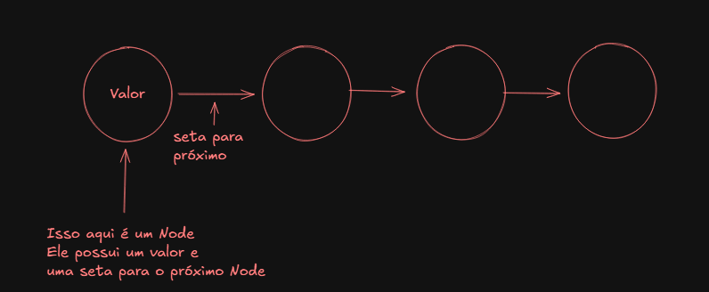
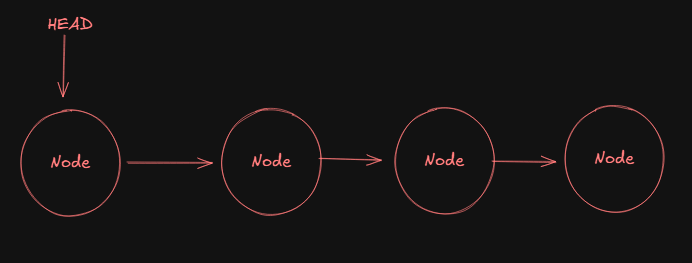
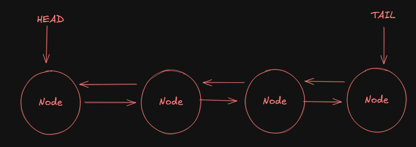

# Criando uma LinkedList

Linked list é uma estrutura de dados que não estão em sequência na memória, assim facilitando ocasiões onde não sabemos
o tamanho exato do input.

A implementação dela já existe em provavelmente todas as linguagens e provavelmente também não iremos precisar implementar
do 0 uma, porém é saber e mostrar que sabemos o pensamento e a construção de uma LinkedList pois assim, irão ver que nós
sabemos como ela funciona, porque foi criada, quais problemas resolvem, como é implementada e sua utilidade...

## Node
Node(nó em português) será, como o nome diz, um nó da nossa linked list, ou seja, um item ali da nossa lista.
Node geralmente possuem um valor e um atributo (uma seta imaginária) que irá apontar para o próximo Node da lista caso 
tenha um.



A imagem acima é um desenho que tenta explicar o que é um Node, perceba que em representações ele é uma circulo que
possui um valor e que aponta para o próximo circulo (Um node também).

Então nossa linkedlist será uma sequência de Nodes apontando para outro Node (caso tenha um próximo Node).

---

## Doubly LinkedList
Também existem as doubly LinkedList, no qual o Node além de apontar para o próximo, ele também aponta para o anterior,
ou seja, além dele conhecer qual o próximo, ele também sabe quem é o anterior.

Geralamente o próximo é chamada de **next** e o anterior é chamado de **prev**

---

## Implementação

Em uma LinkedList é comum termos um ponteiro que aponte para o **head** (cabeça, inicio), ou seja, temos um ponteiro
que aponta para o primeiro Node da LinkedList, simples assim.



Já em um Doubly LinkedList, é comum termos um ponteiro **head** que tem o proposito descrito acima e tambpem temos um
ponteiro **tail** (rabo, final) que aponta para o último Node da LinkedList.



Então resumindo, em um LinkedList temos o head que aponta para o primeiro Node e em uma Doubly Linked List temos o head
e o tail, que apontam respectivamente para o primeiro e o último Node da lista.

--- 

### Inicializando
No inicio, o next será **nulo** e caso for uma Doubly LinkedList, o **prev** também será nulo

Podemos criar abstrações para implementar um LinkedList ou uma Doubly LinkedList, no caso abaixo eu irei citar sobre
uma Doubly LinkedList, tendo em vista que altera poucas coisas para uma LinkedList;

- Primeiro os ponteiros head e o tail são nulos;
- Na abstração podemos criar alguns métodos, entre eles: adicionarAoInicio, adicionarAoFinal, removerDoInicio, removerDoFinal

#### Adicionar Ao Inicio

Declaramos um novo Node e criamos uma condição:

- Se o head da Doubly LinkedList for nulo, ou seja, ela é uma lista vazia então o **head** e o **tail** será igual 
ao novo Node
- Caso não seja nulo, o **next** do novo Node recebe o **head atual** e o **prev** do head atual irá ser o **novo node**
- Após essa condição, o head recebe o novo node

```java []
public void addToFront(Integer value) {
    Node newNode = new Node(value); // Nosso novo Node
    if (this.head == null) { // Condição para ver se  já existe um HEAD na Lista
        this.head = newNode; // Caso não exista, o HEAD será o novo node
        this.tail = newNode; // Caso não exista, o TAIL também será o novo node
    } else {
        newNode.next = head; // Caso exista, o next do novo Node será o HEAD atual
        this.head.prev = newNode; // Caso exista, o prev do HEAD atual será o novo Node
        this.head = newNode; // E o head recebe o novo Node, pois precisamos apontar o HEAD para esse novo Node do inicio
    }
}
```

#### Adicionar ao Final

O método adicionar ao final é muito semelhante ao adicionar ao Inicio, o que muda é que agora iremos estar trabalhando
com o ponteiro TAIl.

Criamos um novo Node que será inserido no final, criamos a condição:
- Se o **TAIL** for **nulo**, ou seja, não tenho Node no final e assim também não terei no HEAD, então o HEAD será o novo Node
- Se o **TAIL** não for **nulo**, então o prev do novo Node será o TAIL atual e o next do TAIL atual será o novo Node
- E depois da condição acabar, o **tail** agora irá ser o **novo Node**

````java
public void addToEnd(Integer value) {
        Node newNode = new Node(value); // Criando novo node a ser inserido no final
        if (this.tail == null) { // Vendo se o TAIL é nulo
            this.head = newNode; // Se for nulo, então o HEAD será o novo Node
        } else { 
            newNode.prev = this.tail; // Se não for nulo, o prev do novo Node é o TAIL atual
            this.tail.next = newNode; // E o next do TAIL atual é o novo node
        }
        this.tail = newNode; // No fim, por último (redundante né), definimos agora que o TAIL será o novo Node criado
    }
````


