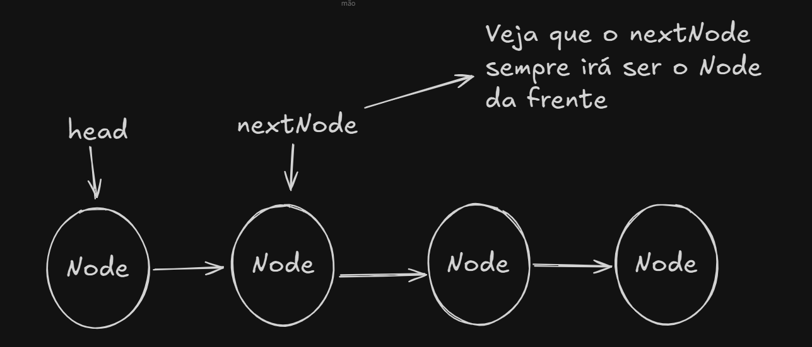

# Inverter LinkedList

Inverter uma LinkedList acredito que seja um dos algoritmos mais comuns que existem além dos de ordenação, aqui tentarei brevemente
implementar uma inversão de LinkedList baseado no video do Galego, só que em Java. 
Já fiz no leetcode e deu certo, agora vou tentar provar que eu realmente sei tentando explicar para você caro leitor pois eu tive um
professor(ou professora, não me lembro agora) que uma vez me disse que se eu não sei explicar para alguém algo, então na verdade eu não sei 
sobre aquilo.

## Explicação

O processo é simples, tenho uma LinkedList e quero inverter sua ordem, existem algumas maneiras de fazer isso e com diferentes complexidades.
A implementação que mostrarei é: Temporal O(N) e Espacial O(1)

Primeiro de tudo, eu crio um novo objeto do tipo ListNode (Nó da lista) e inicialmente ele é nulo e com nome de **newList**. 


Então, de momento está como a imagem acima.

Agora seguindo na implementação eu vou fazer um **while** que será enquanto head for diferente de nulo, no momento que o head for nulo, eu 
saio do laço while. Isso fará sentido mais após mostrar o código dentro do while.

Dentro do laço, eu realizo algumas operações:
- Crio uma nova váriavel do **ListNode** e nomeio ela de **nextNode** e ela irá receber o next do **head** atual, ou seja, aqui eu estou 
  sempre recuperando o Node da frente do atual head.

- Aqui eu começo o processo de inversão, no next do atual head, eu aponto agora para o meu newList, como de momento ele é nulo, então estará 
  apontando para nada de momento

- O próximo passo é definirmos nosso newList recebe o head atual, ou seja, invés de ser nulo, agora ele é o Node head

- E por último, o nosso head agora será o nextNode, ou seja, andamos para frente 


Assim termina a a primeira repetição do laço, iremos continuar a mesma lógica até o head ser nulo

Inicio do próximo laço
- Crio uma nova váriavel do **ListNode** e nomeio ela de **nextNode** e ela irá receber o next do **head** atual, ou seja, aqui eu estou
  sempre recuperando o Node da frente do atual head.

- O next do atual head irá apontar para o newList, o novo nó

- O newList recebe o head atual

- E o head agora será o nextNode


e assim vai indo


Acredito que essa questão do newList tenha ficado um pouco confuso na minha explicação, mas ele é basicamente Node auxiliar que vai recebendo 
os Nodes existentes para facilitar o processo de inversão, então ele começa nulo e dai recebe um Node, dai no outro recebe outro Node e assim 
vai indo, os nodes não deixam de existir, eles apenas são manipulados usando um Node auxiliar(newList)

## Código em Java

O código em Java para essa implementação e para o exercicio 206 do LeetCode

```java []
/**
 * Definition for singly-linked list.
 * public class ListNode {
 *     int val;
 *     ListNode next;
 *     ListNode() {}
 *     ListNode(int val) { this.val = val; }
 *     ListNode(int val, ListNode next) { this.val = val; this.next = next; }
 * }
 */
class Solution {
    public ListNode reverseList(ListNode head) {
        ListNode newList = null;

        while (head != null) {
            ListNode nextNode = head.next;
            head.next = newList;
            newList = head;
            head = nextNode;
        }
        System.gc();
        return newList;
    }
}
```